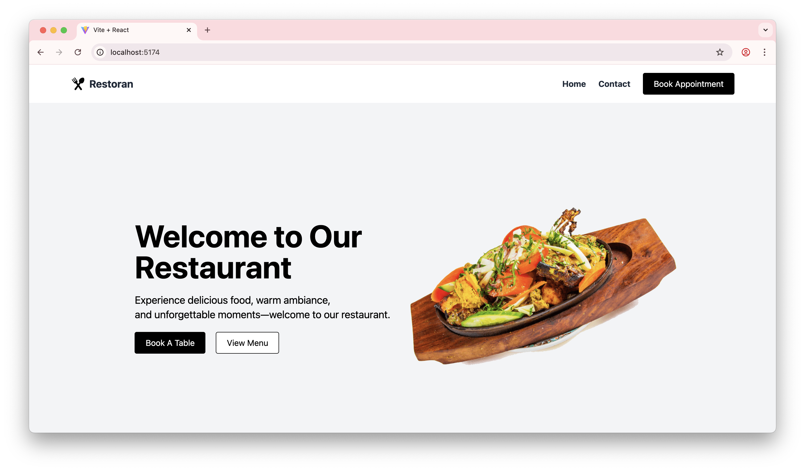

# Restaurant and Booking App (Frontend)

This is the frontend for a Restaurant and Booking web application built with React and Vite.



## Features

- Modern UI for restaurant menu and booking
- Menu section with Breakfast, Lunch, and Dinner, each displayed in a responsive 2-column grid
- Booking modal for making reservations, accessible from the header
- Clean and reusable component structure

## Key Components

- **MenuSection**: Displays food items for breakfast, lunch, and dinner in a 2-column grid layout.
- **Header**: Contains navigation and a "Book Appointment" button that opens a modal.
- **BookingModel**: Modal dialog for booking appointments.
- **FoodItemsCard**: Card component for displaying individual food items.

## How to Use

1. Install dependencies:
   ```bash
   npm install
   ```
2. Start the development server:
   ```bash
   npm run dev
   ```
3. Open your browser at `http://localhost:5173` (or the port shown in your terminal).

## Notes
- The "Book Appointment" button in the header opens a modal for reservations.
- Menu items are organized in a grid for better visual presentation.

---

Feel free to customize and extend the app for your restaurant's needs!
